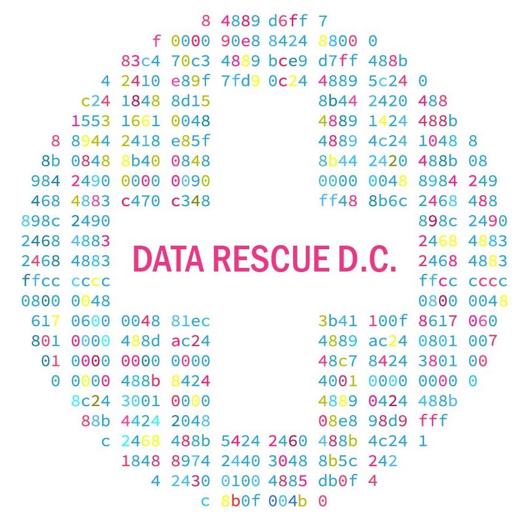

<header>
  
  <h2>datarescueDC</h2>
  <h3>University of Washington 
    Odegaard Undergraduate Library 
    4060 George Washington Lane Northeast 
    Seattle, WA 98195 
    February 25, 2017 
  </h3>
</header>

<iframe src="https://www.google.com/maps/embed?pb=!1m18!1m12!1m3!1d2687.4391012299884!2d-122.3125400489046!3d47.656465592423274!2m3!1f0!2f0!3f0!3m2!1i1024!2i768!4f13.1!3m3!1m2!1s0x549014f329bffff7%3A0x6efe7422cf2f2f93!2sOdegaard+Undergraduate+Library+(OUG)!5e0!3m2!1sen!2sus!4v1487201985277" width="600" height="450" frameborder="0" style="border:0" allowfullscreen></iframe>

Data Rescue Seattle will be held at the University of Washington on February 25, from 12pm-6:30pm in the Odegaard Undergraduate Library. Feel free to arrive late or leave early -- we appreciate any time you can volunteer for this event. Please bring your own laptop.

This event is modeled on the national DataRefuge movement organized by EDGI and Penn's Program in the Environmental Humanities and on DataRescue events at institutions around the United States.

Much of our day will involve collaboratively identifying important online public resources and datasets, nominating URLs to the Internet Archive's End of Term project, using/adapting/creating tools to acquire and back-up further datasets, and getting the word around to others who can do the same.

## Schedule

#### Saturday, February 25th: 12:00 pm to 6:30 pm
Lauinger Library, Murray Conference Room (Room 541)

Saturday's sessions will include:  

##### Humanizing Climate Data: A teach-in on the importance of climate data (12:00-1:30 pm)

* Moderator: [Elizabeth Foster](http://www.library.georgetown.edu/staff/ef534), Public Policy and Social Sciences Librarian, Georgetown University Library
* [Bethany Wiggin](https://www.sas.upenn.edu/germanic/people/bethany-wiggin), Founding Director, Penn Program in Environmental Humanities; Associate Professor of German, University of Pennsylvania
* [Raphael Calel](http://explore.georgetown.edu/people/rac121/), Assistant Professor in the McCourt School of Public Policy, Georgetown University
* [Denice W. Ross](https://www.newamerica.org/our-people/denice-w-ross/) Public Interest Technology Fellow, New America

##### Guide training for Sunday's team leaders (1:30-4:00 pm)  

##### Open data/data vulnerability: A round table discussion (4:15-5:15 pm)  

* Moderator: [Alex Howard](https://sunlightfoundation.com/about/team/ahoward/), Deputy Director, Sunlight Foundation
* [Laurie Allen](http://www.laurieallen.org/), Assistant Director for Digital Scholarship, University of Pennsylvania Libraries
* [Laura Wrubel](https://library.gwu.edu/users/Wrubel), Software Development Librarian; End of Term Archive participant, GWU Libraries
* [Mike Kruger](https://www.commerce.gov/directory/mikekruger), Former Deputy Director of Public Affairs, U.S. Department of Commerce
* [Michael Halpern](http://www.ucsusa.org/bio/michael-halpern.html), Deputy Director, Center for Science and Democracy at the Union of Concerned Scientists

You're welcome to come for Saturday events even if you can't come Sunday.

#### Sunday, February 19th: 10:00 am to 5:00 pm
Reiss Science Building, Room 103

Sunday's session will include a creative coding and archive-a-thon. Please bring a fully charged laptop and a charger, a water bottle (fill stations available), and yourself! A light lunch will be provided courtesy of Johns Hopkins University Sheridan Libraries. You're welcome to come for Sunday events even if you can't come Saturday, stay the whole time or come whenever works for you.

Here is some [parking information], note that the visitor lot at Georgetown is cash only. There may also be street parking in the neighborhood.

## Get Involved

Get in touch: [datarescuedc@gmail.com](mailto:datarescuedc@gmail.com ). Press
inquiries should be directed to Annalisa Dias. We have a #datarescuedc channel
going within the [DataRefuge Slack], drop us a line to join the conversation. 

If you would like to attend DataRescueDC please fill out one of the following forms
after reading the information below about the types of teams that we are looking
for and deciding whether you want to work as a guide or not.

* [Participant Registration]
* [Guide Registration]

## Data Rescue Teams

Guides will take you on these Paths: choose one according to your interests and
skills. If you have skills in one of these areas and want to serve as a guide,
please sign up using the [Guide Registration]. If you would like to help out
fill out the [Participant Registration] form. If you'd rather remain anonymous
for now but can fill out an anonymous participant reigstration, that'll help us know how much food to get.

### Seeding & Sorting

Feeding the End of Term Archive: This is the widest path and requires a variety of skill levels. Consider this path if you are a coder, hacker, have front end web experience, or just have a great attention to details.

### DataRefuge Path

These are the various interwoven paths to get "uncrawlable" data into
DataRefuge:

- **Researchers**: to review URLs the Seeders & Sorters mark as Uncrawlable.
Consider this path if you have a strong front end web experience and like to
find out more information about things.

- **Harvesters**: to figure out how to capture the uncrawlable data. Consider
this path if you're a hacker

- **Checkers**: to inspect a harvested dataset and make sure that it is
complete: The main question the checkers need to answer is "will the bag make
sense to a scientist"? Checkers need to have an in-depth understanding of
harvesting goals and potential content variations for datasets.

- **Baggers**: to do a quality assurance check and package the data. Consider
this path if you have data or web archiving experience, or have strong tech
skills AND attention to detail.

- **Describers**: includes a few people from the Baggers path. Consider this
path if you have experience working with scientific data (particularly climate
or environmental data) or with creating metadata. Trained librarians and
scientists will be very helpful on this path.

### Documentation & Storytelling

Calling people with skills in social media, arts, blogging, photography, journalism, and media. Why and to whom does this data matter? How does this data matter to *you* and your community? In what ways do you imagine this data being used in the future? 

A diverse group of people-not just climate scientists-benefit from this information in a number of ways. From archaeologists and city planners, to indigenous communities and local citizens that inhabit coastal towns, this data is valuable to a variety of stakeholders. We welcome you to write a story about *who* and *which* local communities, organizations, and institutions currently use specific datasets, and how.

## Sponsors
* [Georgetown University Library](http://www.library.georgetown.edu/)
* [Johns Hopkins University Sheridan Libraries](https://www.library.jhu.edu/)

## Collaborators

* [Sunlight Foundation](https://sunlightfoundation.com/)
* [University of Pennsylvania Libraries](http://www.library.upenn.edu/)
* [Penn Program in Environmental Humanities](http://www.ppehlab.org/)
* [Environmental Data Governance Initiative (EDGI)](https://envirodatagov.org/)
* [Climate Mirror](http://climatemirror.org/)
* [University of Michigan Libraries](https://www.lib.umich.edu/)
* [Internet Archive](https://archive.org/)
* [Temple University Libraries](https://library.temple.edu/)
* [ProjectARCC](https://projectarcc.org/)
* [Union of Concerned Scientists](http://www.ucsusa.org/)

[DataRefuge Slack]: https://datarefuge.slack.com/messages/datarescuedc/ 
[Data Rescue event]: http://www.ppehlab.org/what-is-a-datarescue-event
[Data Refuge]: https://www.datarefuge.org/
[GitHub]: https://github.com/datarefuge/datarescue-dc 
[this markdown file]: https://github.com/datarefuge/datarescue-dc/blob/master/index.md
[Participant Registration]: https://docs.google.com/forms/d/e/1FAIpQLSdMPvhEbfy12L1XzzjIpSVT5Ux6bRXoFPcDa6ImT1v1W1rEnA/viewform
[Guide Registration]: https://docs.google.com/forms/d/e/1FAIpQLSdfiv-BtQTf94a-HDMl-XnTf07RBIYppJSJ_BEqAX_h5fRVHQ/viewform
[parking information]: https://transportation.georgetown.edu/Driving-and-Parking
